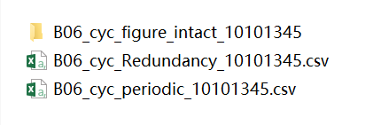
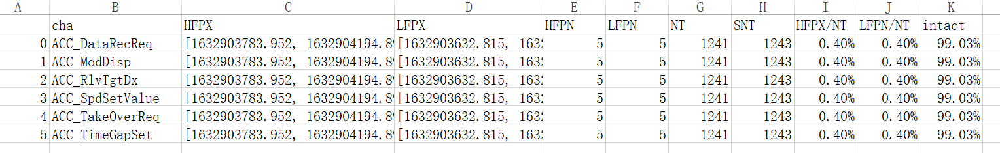
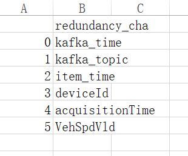
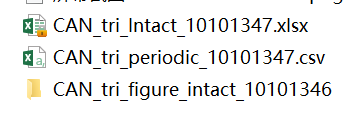
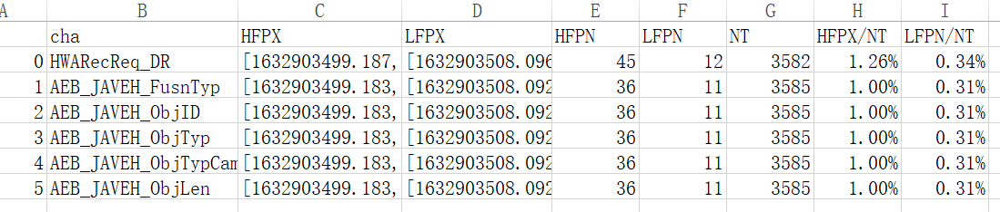
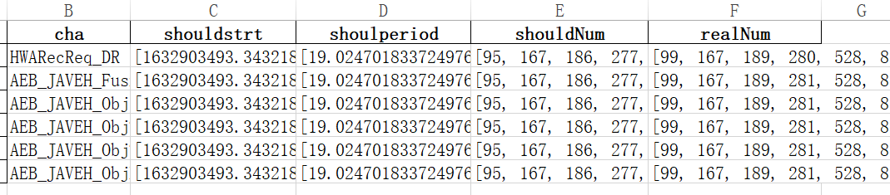
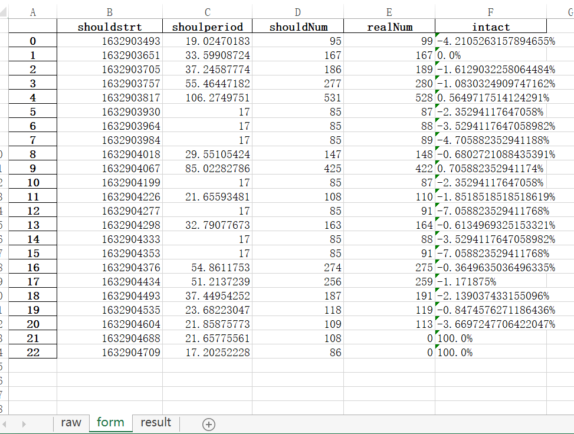
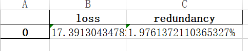

## 引言
<br/>数据验证脚本是为了验证车端回传最终保存进mongoDB数据库的数据是否符合预期。</br>
主要包括一下3各方面：  
1.数据的准确性，数据库中的数据应该与车端数据一致；  
2.数据的完备性，应该按照预期的数据回传规则将数据回传并存入数据库；  
3.数据的周期性，这实际上是对准确性的一个补充，主要通过数据的时间戳检验数据的周期是否符合要求。

[//]:#(代码地址：[https://github.com/jluxiaotao/Data_Compare](https://github.com/jluxiaotao/Data_Compare)) 
代码地址：<a href="https://github.com/jluxiaotao/Data_Compare" target="_blank">https://github.com/jluxiaotao/Data_Compare</a>  

回传至数据库的数据有**周期型回传数据**和**触发型回传数据**。周期型回传是指在车辆上电状态下，按照固定的周期不间断的将车辆数据回传至数据库。触发型回传是指车辆状态满足预先设定的触发条件时，将触发时刻前后一段时间数据回传至数据库。通常触发型回传数据的采样频率要比周期性回传数据高。  
触发收集模块根据车辆状态判断是否收集数据，同时将需要回传的数据不间断地发送至CAN总线上。网关根据触发收集请求信号判断是否将触发请求时间点之前一段时间缓存的数据及后续一段时间的数据发送给T-BOX。T-BOX通过无线网络将数据回传至云端，云端进行一系列操作最终存入数据库。
## 车端数据
测试时利用CAN工具录制触发收集模块发送到CAN总线上的触发型回传数据以及其他节点发送到CAN总线上的周期型回传数据，数据格式为MDF或mf4格式。
## mongoDB数据库数据
登录mongoDB数据库服务器，用mongodump命令将与车端数据对应的数据下载至本地，然后用mongorestore命令将数据还原至本地的mongoDB数据库。
## 数据的准确性
数据是一系列随时间变化的值，以车端录制的数据为参考，回传至数据库的数据的准确性可以用两个时间序列数据的相似程度来反映。[Acquisition_Validation_Similarity](https://github.com/jluxiaotao/Data_Compare/blob/master/Acquisition_Validation_Similarity%203.0.py)可以对比车端和mongoDB中数据的相似度。  
**验证时根据实际情况设置下列参数：**  
inputdir：mf4文件的存放路径，该文件夹只存储当前要分析的mf4数据  
outdir: 输出结果存放的路径  
infodir：输入信息文件路径  
mongo_str: 连接mongoDB的地址，mongodb://localhost:27017/为本地数据库  
database：mongoDB中云端数据的数据库名称  
collection：集合名称  
frame2group_file：触发回传信号group名称与报文ID的对应关系（提供的触发回传信号表中只有报文ID，且信号名、排列顺序等与can矩阵文件不完全一致，存储地址为infodir   
**设置好上述参数后，设置下列两个参数可以分别对触发回传和周期回传数据的准确性进行验证：**    
can_name: trigger-can-t5-v71和cycle-can-t5-v71，分别代表触发和周期回传数据验证
channels_file: 触发或周期回传信号列表，存储地址为infodir  
```
inputdir=r"c:\Users\GW00229018\Desktop\工作\1.上传数据验证分析\1.数据\mf4_selected"
outdir=r"C:\Users\GW00229018\Desktop\工作\1.上传数据验证分析\2.处理过程"
infodir=r"C:\Users\GW00229018\Desktop\工作\1.上传数据验证分析\2.处理过程\info"
mongo_str="mongodb://localhost:27017/"
database="de"
collection="data.hwa_bd.LGWFF6A51MH000013"
can_name="trigger-can-t5-v71"
conn=pm.MongoClient(mongo_str)
coll=conn[database][collection]
frame2group_file="V61V71_trigger_group_list.xlsx"
# channels_file="B01周期型采集需求提报-毫末智行科技有限公司-苏硕-V1.1.xlsx"
# channels_file="B02-SIT环境-周期型采集需求提报-毫末智行科技有限公司-苏硕-V1.1.xlsx"
channels_file="CANmatrix导入模板-V71燃油-V1.3-20210713.xlsx"
# channels_file="V71-001-027MM01 C_Matrix for DR_CANFD_V1.5.xlsx"
# channels_file="V71 周期型采集需求提报-毫末智行科技有限公司-苏硕-V1.2.2.xlsx"
# channels_file="V61HEV车型.xlsx"
# channels_file="V51HEV.xlsx"
# channels_file="B03HEV周期型采集需求提报-毫末智行科技有限公司-苏硕-V1.2.xlsx"
# channels_file="P01生产环境VIN（LGWFF7A55LJ000044）周期型采集需求提报-毫末智行科技有限公司-苏硕-V1.2.2.xlsx"
# channels_file="B06.xlsx"
```
sim_lim为相似度限值，当相似度小于该值时会输出图片及csv格式的数据表格，程序会在outdir中新建文件夹并保存起来。  
在对比数据时，程序会逐个读取mf4文件与数据库中数据对比，当sim_lim小于限值时默认会输出1张图片，但是当录制的mf4数据时间较长时输出图片的可读性较差，因此可以用figsplitNum将图片分成多张图片输出。  
由于触发回传信号量较大，当需要快速检验数据是否正确按照触发回传请求信号回传数据时，可以只对比Trigger信号和Time信号，将TriggerAndTimeOnly设置为True。这里的Trigger信号为触发回传请求信号，Time信号为添加时间戳时参考的时间信号的秒值。
`DC=DataComparison(coll,selected_files,channels_file,frame2group_file,can_name,outdir,infodir,TriggerAndTimeOnly=False,sim_lim=0.5,figSpltNum=1)`  
程序的输出结果为每个mf4文件中相似度小于sim_lim的信号的图片、数据和相似度结果表格。  
<center>  
  
</center>  
**通过相似度的限制筛选出的信号是否有问题还需要查看图片进行辨别。**
## 数据的完备性和周期性      
[Acquisition_Validation_Periodic](https://github.com/jluxiaotao/Data_Compare/blob/master/Acquisition_Validation_Periodic%203.0.py)用来验证回传的数据是否完整，频率是否稳定，也即其完备性和周期性。
在车辆上电状态下，周期回传数据应该按照**固定的周期/频率不间断地**回传至数据库。触发回传数据应该**根据触发回传请求信号的变化情况**回传数据，且回传的数据频率应稳定正常。 
triggerlogic_file：该文件是触发回传逻辑的描述，结合触发回传请求信号可以计算出理论上回传数据的时间段。    
**设置下列两个参数可以分别对触发回传和周期回传数据的准确性进行验证：**      
can_name: trigger-can-t5-v71和cycle-can-t5-v71，分别代表触发和周期回传数据验证
channels_file: 触发或周期回传信号列表，存储地址为infodir    
```
inputdir=r"c:\Users\GW00229018\Desktop\工作\1.上传数据验证分析\1.数据\mf4_selected"
outdir=r"C:\Users\GW00229018\Desktop\工作\1.上传数据验证分析\2.处理过程"
infodir=r"C:\Users\GW00229018\Desktop\工作\1.上传数据验证分析\2.处理过程\info"
mongo_str="mongodb://localhost:27017/"
database="de"
can_name="cycle-can-t5-v71"
collection="data.hwa_bd.LGWEF5A54LH000382"
conn=pm.MongoClient(mongo_str)[database]
coll=conn[collection]
triggerlogic_file="trigger_logic.xlsx"

# channels_file="B01周期型采集需求提报-毫末智行科技有限公司-苏硕-V1.1.xlsx"
# channels_file="B02-SIT环境-周期型采集需求提报-毫末智行科技有限公司-苏硕-V1.1.xlsx"
# channels_file="CANmatrix导入模板-V71燃油-V1.3-20210713.xlsx"
# channels_file="V71-001-027MM01 C_Matrix for DR_CANFD_V1.5.xlsx"
# channels_file="V71 周期型采集需求提报-毫末智行科技有限公司-苏硕-V1.2.2.xlsx"
# channels_file="V61HEV车型.xlsx"
# channels_file="V51HEV.xlsx"
# channels_file="B03HEV周期型采集需求提报-毫末智行科技有限公司-苏硕-V1.2.xlsx"
# channels_file="P01生产环境VIN（LGWFF7A55LJ000044）周期型采集需求提报-毫末智行科技有限公司-苏硕-V1.2.2.xlsx"
channels_file="B06.xlsx"
```  
由于信号数量很大，且一般每个信号的周期性和完备性无差别。程序会对前CalcuNum个信号的周期性和完备性进行检查并输出图片，仅有前cha_showNum个信号会输出图片。  
```DIV=DataIntactValidation(coll,conn,outdir,infodir,can_name,channels_file,triggerlogic_file,selected_files,cha_showNum=1,CalcuNum=5)```    
**当can_name为cycle-can-t5-v71，channels_file选择相应的周期信号列表时**，输出结果包含两个csv表格和一个存储图片的文件夹。文件夹中为频率异常点的图片。  
<center> 

</center>  
_cyc_periodic_表格中cha为信号名，HFPX(High Frequency Point X-axis)为高频异常点的时间戳，LFPX为低频异常点的时间戳。HFPN为高频点数量，LFPN为低频点数量。NT(Total Number)为总数量，SNT为理论数据总量，理论数据量根据起始和结束时间及理论频率计算得到。  
<center> 

</center>  
_cyc_redundancy表格中是数据库中多余的信号名称。  
<center> 

</center>  
**当can_name为trigger-can-t5-v71，channels_file选择相应的周期信号列表时**，输出结果包含一个csv表格、一个xlsx表格和一个存储图片的文件夹。文件夹中为所有触发数据片段的图片。  
<center> 

</center>
_tri_periodic_与_cyc_periodic_含义相同。  
<center> 

</center>
_tri_intact_中共有3个工作簿，分别为raw，form，result。raw中shouldstrt为所有理论触发数据片段的起始时间，shouldperiod为理论持续时间，shouldNum为理论数据量，realNum为实际数据量。
<center> 

</center>
form中为raw中第一行的展开。intact=(1-realNum/shouldNum)*100%
<center> 

</center>
result中loss为100%减去所有intact大于0的数据片段的实际数据量之和与理论数据量之和的比值，redundancy为100%减去所有intact小于0的数据片段的实际数据量之和与理论数据量之和的比值。
<center> 

</center>
